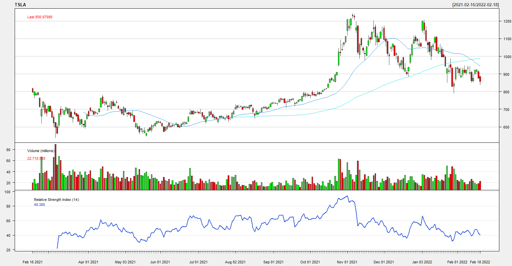

# Tesla-Share-Price-Plot
Basic share price plot of Tesla using R.

We plot share price of the Tesla for the past 1 year's performance. It even includes couple of indicators which are (Simple) Moving Average (SMA) and Relative Strength Index (RSI).

**Simple Moving Average (SMA)** is simply the average price over the specified period of time. Short-term averages (50 day SMA and below) respond quickly to changes in the price of the underlying security, while long-term averages (100 day SMA and beyond) are slower to react. 

**The Relative Strength Index (RSI)** is a measurement used by traders to assess the price momentum of a stock or other security. It simple helps the traders to identify whether the stock is in overbought or in oversold zone. It scales from 0 to 100 .In general, when 14-day RSI goes below 30 is considered as oversold zone and when it goes above 70 is considered as overbought zone. 

**Language used:** R Programming

**Result of our code:**

Kudos!!
